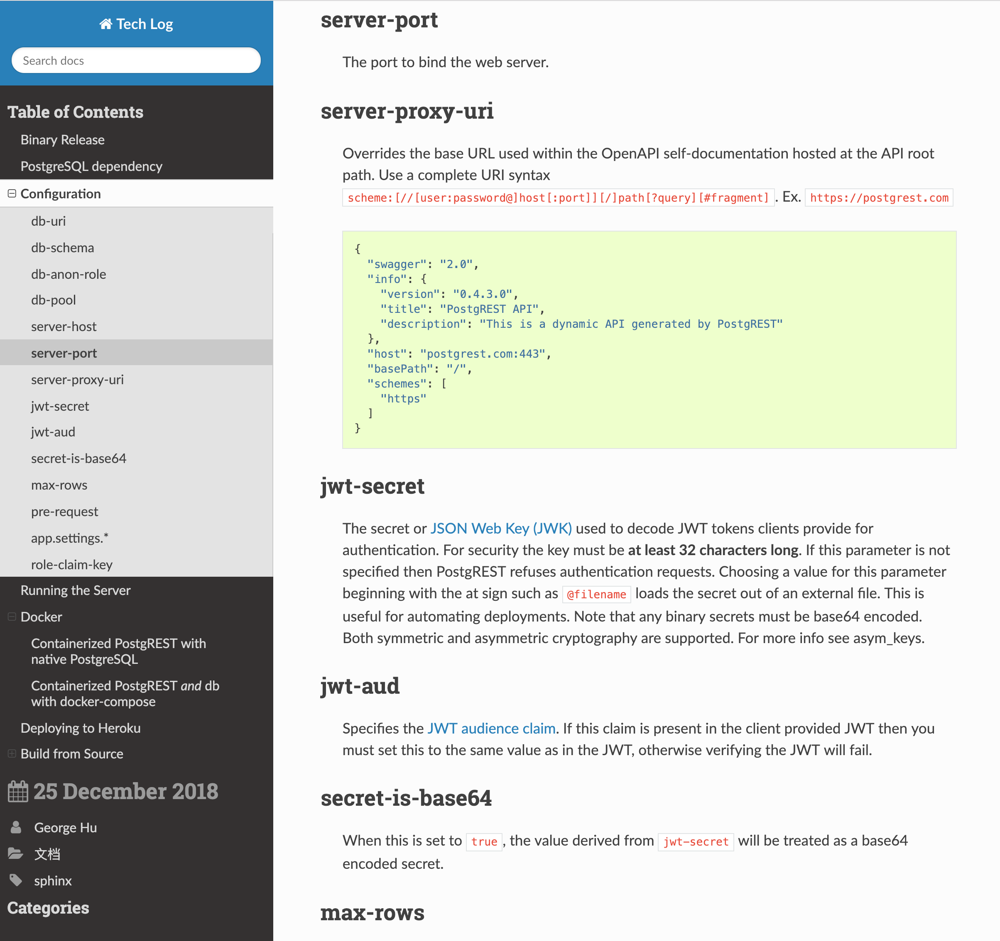
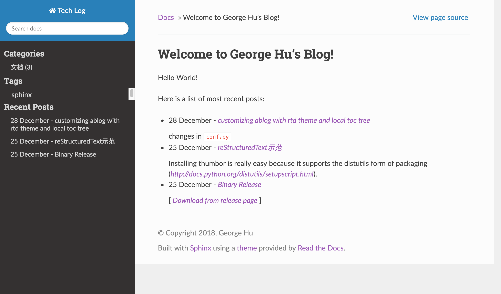

Customizing ablog with rtd theme and local toc tree
===================================================

.. post:: Dec 28, 2018
   :tags: sphinx
   :category: 文档

Screenshots after the customization
------------------------------------

The local toc tree in the side bar:

The Ablog features in the side bar:

Configuration in ablog
----------------------

changes in ``conf.py``

.. code:: python

  html_theme = 'sphinx_rtd_theme'

  # add localtoc.html
  html_sidebars = {
      '**': [ 'localtoc.html', ...
            ]
      }

  # custom.css
  html_context = {
    'css_files': ['_static/custom.css'],
  }

in the ``_static`` directory create custom.css

.. code:: css

  .wy-menu-vertical h3 {
    margin-bottom: 0px;
  }

  .wy-menu-vertical h2 {
    margin-top: 10px;
    margin-bottom: 10px;
    padding: 0 0.4em;
  }

  .wy-menu-vertical h3 a {
    padding: 0.4em 0.5em !important;
  }

  .ablog a {
    display: inline-block !important;
    padding-left: 0.4em;
  }

  .ablog li {
    padding: 0 0.5em;
  }

enter into ``site-packages`` directory of your project environment, locate the ``ablog`` directory, open the ``postcard.html`` and make the following change:

.. code:: html

  ...
  <ul class="ablog"> {# change here #} 
  
  ...

Changes in sphinx_rtd_theme
----------------------------

enter into ``site-packages`` directory of your project environment, locate the ``sphinx_rtd_theme`` directory, and open the ``layout.html``, change the file according to following code:

.. code-block:: html

  

    
      {#
        The singlehtml builder doesn't handle this toctree call when the
        toctree is empty. Skip building this for now.
      #}
      
        
      
      
        {{ global_toc }}
      
        <!-- Local TOC -->
        <!-- 
{{ toc }}
 --> {# comment out to avoid double entries of toc #}
      
    
     {# added #}
     {# added #}
     {# added #}
     {# added #}
     {# added #}

  

Change the sphinx code to generate the local toctree for our purpose
---------------------------------------------------------------------

open ``site-packages/sphinx/builders/html.py``, locate the line with ``# local TOC and global TOC tree``, change according the following code:

.. code:: python

      # local TOC and global TOC tree, with local toctree
      self_toc = TocTree(self.env).get_toc_for(docname, self)
      toc = self.render_partial(self_toc)['fragment']
      self._toctree_add_classes(self_toc, docname, 2)
      local_toctree = self.render_partial(self_toc)['fragment']

      return dict(
          parents = parents,
          prev = prev,
          next = next,
          title = title,
          meta = meta,
          body = body,
          metatags = metatags,
          rellinks = rellinks,
          sourcename = sourcename,
          toc = toc,
          local_toctree = local_toctree,
          # only display a TOC if there's more than one item to show
          display_toc = (self.env.toc_num_entries[docname] > 1),
          page_source_suffix = source_suffix,
      )

  # adding the logic of generating local toctree
  def _toctree_add_classes(self, node, docname, depth):
      # type: (nodes.Node, int) -> None
      """Add 'toctree-l%d' and 'current' classes to the toctree."""
      for subnode in node.children:
          if isinstance(subnode, (addnodes.compact_paragraph,
                                  nodes.list_item)):
              # for 
 and <li>, indicate the depth level and recurse
              subnode['classes'].append('toctree-l%d' % (depth - 1))
              self._toctree_add_classes(subnode, docname, depth)
          elif isinstance(subnode, nodes.bullet_list):
              # for <ul>, just recurse
              self._toctree_add_classes(subnode, docname, depth + 1)
          elif isinstance(subnode, nodes.reference):
              # for <a>, identify which entries point to the current
              # document and therefore may not be collapsed
              if subnode['refuri'] == docname:
                  if not subnode['anchorname']:
                      # give the whole branch a 'current' class
                      # (useful for styling it differently)
                      branchnode = subnode
                      while branchnode:
                          branchnode['classes'].append('current')
                          branchnode = branchnode.parent
                  # mark the list_item as "on current page"
                  if subnode.parent.parent.get('iscurrent'):
                      # but only if it's not already done
                      return
                  while subnode:
                      subnode['iscurrent'] = True
                      subnode = subnode.parent
